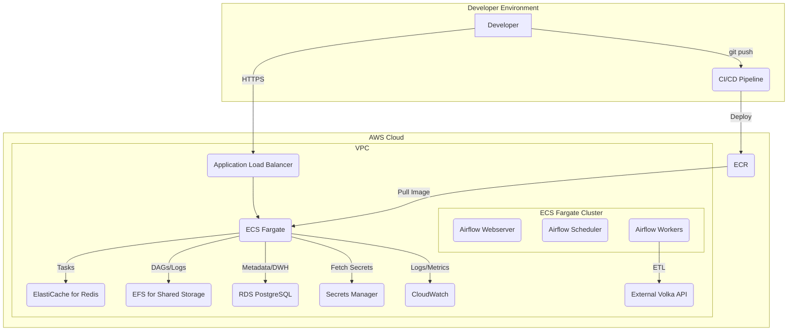

# Volka Games Marketing Data Pipeline

This repository contains a comprehensive, production-ready data pipeline designed to ingest marketing campaign data from an API, process it, and load it into a data warehouse for analytics and reporting. The entire infrastructure is defined as code (IaC) using Terraform for repeatable, automated deployments on AWS.

## Table of Contents
- [1. Core Technologies](#1-core-technologies)
- [2. Architecture Deep Dive](#2-architecture-deep-dive)
  - [2.1. Production Architecture (AWS & Terraform)](#21-production-architecture-aws--terraform)
  - [2.2. Local Development Environment (Docker)](#22-local-development-environment-docker)
- [3. Data Pipeline Workflow](#3-data-pipeline-workflow)
  - [3.1. Orchestration with Airflow](#31-orchestration-with-airflow)
  - [3.2. Extract & Load (Python ETL)](#32-extract--load-python-etl)
  - [3.3. Transformation & Modeling (dbt)](#33-transformation--modeling-dbt)
- [4. Data Schema](#4-data-schema)
  - [`public.campaign_performance_raw_appends`](#publiccampaign_performance_raw_appends)
- 5. Security
- 6. Getting Started
  - 6.1. Environment Variables
  - 6.2. Local Development Setup
  - 6.3. AWS Deployment (Terraform)
- 7. Reporting & Testing
- 8. CI/CD Automation

## 1. Core Technologies

| Category              | Technology                               | Role & Purpose                                                                                             |
| --------------------- | ---------------------------------------- | ---------------------------------------------------------------------------------------------------------- |
| **Orchestration**     | Apache Airflow                           | Manages the entire pipeline workflow, scheduling, retries, and dependencies between tasks.                 |
| **Infrastructure**    | Terraform, AWS                           | Defines and provisions all cloud resources (compute, database, networking, etc.) in a repeatable manner.   |
| **Containerization**  | Docker                                   | Packages the application and its dependencies for consistent local development and production deployment.    |
| **ETL & Processing**  | Python (Pandas, Psycopg2)                | Extracts data from the source API, performs validation and transformation, and loads it into the database. |
| **Data Transformation** | dbt (Data Build Tool)                    | Manages in-database transformations, building clean, tested, and aggregated reporting models from raw data.  |
| **Database**          | PostgreSQL                               | Serves as the data warehouse for both raw and transformed data.                                            |
| **Message Broker**    | Redis                                    | Acts as the message broker for Airflow's Celery Executor, enabling distributed task execution.             |

## 2. Architecture Deep Dive

The architecture is designed to be robust, scalable, and cost-effective by leveraging serverless and managed services on AWS.

### 2.1. Production Architecture (AWS & Terraform)

The entire cloud infrastructure is defined and managed using **Terraform**. This approach, known as Infrastructure as Code (IaC), is fundamental to the project's reliability and scalability.

#### Architecture Diagram



#### Why Infrastructure as Code with Terraform?

Choosing to manage our infrastructure with Terraform is a strategic decision that provides significant advantages over manual setup or console-based configuration:

*   **Repeatability & Consistency**: Every environment, from development to production, is provisioned from the same codebase. This eliminates "it works on my machine" problems and ensures consistency, drastically reducing deployment errors.
*   **Automation & Speed**: Terraform enables the entire infrastructure to be created, updated, or destroyed with a few commands. This is critical for CI/CD pipelines, allowing for automated deployments and rapid iteration.
*   **Version Control & Collaboration**: By storing infrastructure definitions in Git, we gain a full history of all changes. We can use pull requests to review infrastructure modifications, just like application code, fostering collaboration and improving quality.
*   **Disaster Recovery**: In the event of a regional failure or catastrophic error, Terraform can recreate the entire production environment from scratch in a new region within minutes, not hours or days. This provides a robust and predictable disaster recovery plan.
*   **Modularity & Reusability**: The infrastructure is broken down into logical, reusable modules. This makes the system easier to understand, maintain, and scale. Adding a new service or environment becomes a matter of composing existing modules.

| Service                       | Role in Pipeline                                                                                             | Justification (Cost & Performance)                                                                                                                              |
| ----------------------------- | ------------------------------------------------------------------------------------------------------------ | --------------------------------------------------------------------------------------------------------------------------------------------------------------- |
| **ECS Fargate**               | **Serverless Compute**: Runs the Airflow Webserver, Scheduler, and Worker containers without managing servers. | **Cost-Effective**: Pay-per-use model for CPU/memory. **High Capability**: Scales seamlessly to handle varying workloads.                                       |
| **Application Auto Scaling**  | **Dynamic Worker Scaling**: Automatically adjusts the number of Airflow workers based on CPU/Memory load.      | **Cost-Effective**: Scales down to a minimum count during idle periods. **High Capability**: Scales up to handle high task concurrency.                           |
| **Amazon RDS (PostgreSQL)**   | **Managed Data Warehouse**: Stores the raw and transformed campaign data.                                    | **Cost-Effective**: Reduces operational overhead (no patching/backups). **High Capability**: Provides reliable, consistent performance and high availability.     |
| **Amazon ElastiCache (Redis)**| **Celery Broker**: Manages the queue of tasks to be executed by the Airflow workers.                           | **Cost-Effective**: A managed service is more efficient than self-hosting. **High Capability**: Low-latency, high-throughput broker for distributed tasks.      |
| **Amazon EFS**                | **Shared File System**: Persists Airflow DAGs and logs, making them accessible to all components.              | **Cost-Effective**: EFS Lifecycle Policy automatically moves old logs to cheaper Infrequent Access storage. **High Capability**: Provides shared state.         |
| **Application Load Balancer** | **Secure Web Access**: Exposes the Airflow UI securely to the internet over HTTPS.                             | **Cost-Effective**: Pay-per-use. **High Capability**: Provides a stable, secure entry point with health checks and SSL termination.                               |
| **Amazon S3**                 | **Asset & Backup Storage**: Stores raw data backups and could host Airflow DAGs.                               | **Cost-Effective**: Extremely cheap and durable object storage. **High Capability**: Highly available and scalable.                                               |
| **AWS Secrets Manager**       | **Centralized Secrets**: Securely stores and manages all credentials (API keys, DB passwords).                 | **Cost-Effective**: Low cost per secret. **High Capability**: Enhances security by removing secrets from code and providing fine-grained access control via IAM. |
| **IAM**                       | **Permissions Management**: Defines granular permissions for every service, adhering to the principle of least privilege. | **Security Best Practice**: Essential for a secure cloud environment.                                                                                             |
| **CloudWatch**                | **Logging & Monitoring**: Aggregates logs from all Airflow components and provides metrics for monitoring.     | **Operational Excellence**: Centralized logging is critical for debugging and monitoring pipeline health.                                                         |

### 2.2. Local Development Environment (Docker)

The local environment, defined in `docker-compose.yml`, is a high-fidelity replica of the production setup.

*   **Service Parity**: It runs all core Airflow components (webserver, scheduler, worker, flower), PostgreSQL, and Redis in separate containers.
*   **Live Reloading**: Local directories (`airflow_dags`, `etl`, `dbt_project`) are mounted as volumes into the containers, allowing for immediate code changes without rebuilding the image.
*   **Consistency**: The custom `Dockerfile` ensures that the local environment uses the same dependencies and setup as the image deployed to production on ECS Fargate.

## 3. Data Pipeline Workflow

The pipeline is orchestrated by a main Airflow DAG that coordinates the Extract, Load, and Transform steps.

### 3.1. Orchestration with Airflow

*   **Celery Executor**: The pipeline uses the Celery Executor, allowing tasks to be distributed across a pool of auto-scaling worker containers for high throughput.
*   **Dynamic DAGs**: The dbt-related DAGs are generated dynamically by `dbt_dag_factory.py`. This factory reads a `dbt_dag_config.yml` file, allowing new dbt workflows to be added or modified with a simple YAML change, rather than writing new Python code. This is a highly scalable and maintainable pattern.

### 3.2. Extract & Load (Python ETL)

The core extraction logic resides in `etl/etl_script.py`.

1.  **Incremental Loading**: The script first checks the database for the most recent date loaded. It then only fetches data from that point forward, making daily runs efficient.
2.  **Initial Backfill**: If the database is empty, it automatically triggers a 5-year historical backfill, fetching data in monthly chunks to avoid overwhelming the API.
3.  **Data Validation & Cleaning**: Using `pandas`, the script performs crucial data quality checks: it coerces data types, handles nulls, replaces infinite values, and ensures metrics like `spend` are non-negative.
4.  **Append-Only Loading**: The script performs a simple, efficient append-only load into a raw data table (`public.campaign_performance_raw_appends`). It does not perform any updates or deletes, ensuring the load step is fast and atomic. The responsibility for handling historical data is passed downstream to dbt.

### 3.3. Transformation & Modeling (dbt)

After raw data is loaded, dbt orchestrates all in-database transformations. The process begins with `dbt snapshot` to capture data history, followed by a **Medallion Architecture** approach to model the data.

*   **Snapshots (History Layer):**
    *   **Purpose:** The first step in dbt is to run `dbt snapshot`. This command reads the raw, append-only data and intelligently builds a Slowly Changing Dimension (SCD) Type 2 table. It automatically handles the logic to track changes to records over time, creating a full, reliable history of every metric. This replaces the complex SCD2 logic previously in the Python script.

#### Data Flow & Model Layers

*   **Bronze Layer (Source Data):**
    *   **Table:** `public.campaign_performance_raw_appends`
    *   **Purpose:** This is the raw, append-only data exactly as it was loaded by the Python ETL script. It serves as the immutable log of all data received from the API.
    *   **Data Quality:** Basic data integrity is enforced at this layer using dbt source tests defined in `dbt_project/models/staging/sources.yml`. These tests check for `not_null` on key columns and data freshness via the `_etl_loaded_at` column.


*   **Silver Layer (Staging Models):**
    *   **Path:** `dbt_project/models/staging/`
    *   **Purpose:** Models in this layer select only the *current, active records* from the historical snapshot table (where `dbt_valid_to is null`). They perform light, foundational transformations to clean and prepare the data for analytics. This includes:
        *   Casting data to the correct types (e.g., `NUMERIC`, `INTEGER`).
        *   Renaming columns for business clarity (e.g., `campaigns_execution_date` -> `report_date`).
        *   Converting monetary values from cents to a standard currency unit (e.g., EUR).
        *   Standardizing categorical values.
    *   The goal of the Silver layer is to create a clean, atomic, and trustworthy dataset that serves as a reliable source for all downstream business logic.

    <details>
    <summary><b>Click to see an example Staging Model: <code>stg_campaign_performance.sql</code></b></summary>

    ```sql
    -- models/staging/stg_campaign_performance.sql
    
    with source as (
        -- Use the dbt snapshot to get the current version of each record
        select * from {{ ref('scd_campaign_performance') }}
        where dbt_valid_to is null -- This filter selects only the currently active records
    ),

    renamed_and_cleaned as (
        select
            -- Identifiers and Dates
            campaigns_execution_date as report_date,
            campaign_name,
            ad_name,

            -- Metrics (convert from cents to standard currency unit)
            spend_cents / 100.0 as spend_eur,
            impressions,
            clicks,
            registrations,
            cpc_cents / 100.0 as cpc_eur,
            ctr,
            cr,

            -- Lifeday metrics
            players_1d,
            payers_1d,
            payments_1d,
            revenue_1d_cents / 100.0 as revenue_1d_eur,
            players_3d,
            payers_3d,
            payments_3d,
            revenue_3d_cents / 100.0 as revenue_3d_eur,
            players_7d,
            payers_7d,
            payments_7d,
            revenue_7d_cents / 100.0 as revenue_7d_eur,
            players_14d,
            payers_14d,
            payments_14d,
            revenue_14d_cents / 100.0 as revenue_14d_eur
        from source
    )
    
    select * from renamed_and_cleaned
    ```
    </details>
    
    **Model Purpose:** This model acts as the first cleaning layer. It selects only the current, active records from the historical snapshot table and performs foundational transformations: renaming columns for business clarity, casting data types, and converting monetary values from cents to a standard currency unit. The result is a clean, atomic dataset that serves as a reliable source for all downstream business logic.
*   **Gold Layer (Core Models):**
    *   **Path:** `dbt_project/models/marts/core/`
    *   **Purpose:** This layer creates the core data marts of the data warehouse. It takes the clean, atomic data from the Silver layer and models it into robust fact and dimension tables. These models represent key business entities and processes, serving as a stable and reliable "single source of truth" for analytics. They are typically materialized as tables for performance.

*   **Gold Layer (Reporting Models):**
    *   **Path:** `dbt_project/models/marts/reporting/`
    *   **Purpose:** This layer contains the final business logic. It aggregates the well-structured data from the **Core Models** into denormalized tables or views, often called "data marts," which are optimized for specific reporting and business intelligence use cases.
    *   **Key Model (`monthly_campaign_summary`):** This model is a prime example. It is materialized as a **view** and rolls up data to a monthly level for each campaign, calculating critical business KPIs like ROAS, CPI, and Retention Rate.


    <details>
    <summary><b>Click to see an example Reporting Model: <code>monthly_campaign_summary.sql</code></b></summary>

    ```sql
    -- models/marts/reporting/monthly_campaign_summary.sql

    {{ config(
        materialized='view'
    ) }}

    with daily_data as (
        select * from {{ ref('stg_campaign_performance') }}
    ),

    monthly_agg as (
        select
            date_trunc('month', report_date)::date as report_month,
            campaign_name,

            -- Aggregate base metrics by summing up daily values
            sum(spend_eur) as total_spend,
            sum(impressions) as total_impressions,
            sum(clicks) as total_clicks,
            sum(registrations) as total_registrations,

            -- Aggregate lifeday metrics for all required time windows
            sum(revenue_3d_eur) as total_revenue_3d,
            sum(payers_3d) as total_payers_3d,
            sum(players_3d) as total_players_3d,

            sum(revenue_7d_eur) as total_revenue_7d,
            sum(payers_7d) as total_payers_7d,
            sum(players_7d) as total_players_7d,

            sum(revenue_14d_eur) as total_revenue_14d,
            sum(players_14d) as total_players_14d,
            sum(payers_14d) as total_payers_14d

        from daily_data
        group by 1, 2
    ),

    final_view as (
        select
            -- Dimensions
            report_month,
            campaign_name,

            -- Base Metrics for Excel Report
            total_spend,
            total_impressions,
            total_clicks,
            total_registrations,
            total_payers_14d,
            total_revenue_14d,

            -- Required KPIs for the View
            total_revenue_3d / nullif(total_spend, 0) as roas_3d,
            total_spend / nullif(total_registrations, 0) as cpi, -- Cost Per Install/Registration
            total_spend / nullif(total_payers_14d, 0) as cpp_14d, -- Cost Per Payer 14d
            total_players_14d / nullif(total_registrations, 0) as retention_rate_14d

        from monthly_agg
    )

    select * from final_view
    ```
    </details>
    
    **Model Purpose:** This model creates a business-ready summary. It aggregates the clean daily data from the Silver layer into a monthly view for each campaign, calculating key performance indicators (KPIs) like Return on Ad Spend (ROAS) and Cost Per Payer (CPP). Materialized as a view, it provides a simple, high-level summary that directly answers critical business questions without consuming additional storage.
This structured approach ensures that business logic is centralized, tested, and well-documented within dbt, providing a single source of truth for reporting.

#### dbt Project Configuration

The dbt project's behavior is defined by two key files: `dbt_project.yml` and `profiles.yml`.

*   **`dbt_project.yml`**: This is the main configuration file for the dbt project. It defines the project name, model paths, and crucially, the `profile` to use for database connections.

    ```yaml
    # dbt_project/dbt_project.yml
    name: 'volka_marketing'
    version: '1.0.0'
    config-version: 2

    profile: 'volka_marketing_dwh'

    model-paths: ["models"]
    analysis-paths: ["analyses"]
    test-paths: ["tests"]
    seed-paths: ["seeds"]
    macro-paths: ["macros"]
    snapshot-paths: ["snapshots"]

    target-path: "target"
    clean-targets:
      - "target"
      - "dbt_packages"
    ```

*   **`profiles.yml`**: This file (which should **not** be committed to version control) contains the actual database connection credentials. dbt uses the `profile` name from `dbt_project.yml` to find the correct connection details here. It is typically configured to read from environment variables.

    ```yaml
    # Located at ~/.dbt/profiles.yml or in the dbt_project directory
    volka_marketing_dwh:
      target: dev
      outputs:
        dev:
          type: postgres
          host: "{{ env_var('DB_HOST') }}"
          user: "{{ env_var('DB_USER') }}"
          password: "{{ env_var('DB_PASSWORD') }}"
          port: "{{ env_var('DB_PORT') | int }}"
          dbname: "{{ env_var('DB_NAME') }}"
          schema: public
          threads: 4
    ```

## 4. Data Schema
The raw data extracted from the API is loaded into the `campaign_performance_raw_appends` table in PostgreSQL. This table is a simple, append-only log of all data fetched from the API. A `dbt snapshot` is then used to build a historical (SCD Type 2) table from this raw data.

### `public.campaign_performance_raw_appends`
| Column Name                 | Data Type (PostgreSQL)     | Description                                                                                                                            |
| --------------------------- | ---------------------- | -------------------------------------------------------------------------------------------------------------------------------------- |
| **Natural Key**             |                        | ---                                                                                                                                    |
| `campaigns_execution_date`  | `DATE`                 | The specific date for which the performance metrics are recorded. Part of the natural key.                                             |
| `campaign_name`             | `VARCHAR`              | The name of the marketing campaign. Part of the natural key.                                                                           |
| `ad_name`                   | `VARCHAR`              | The name of the specific ad within the campaign. Defaults to 'N/A' if not provided by the API. Part of the natural key.                  |
| **Core Metrics**            |                        | ---                                                                                                                                    |
| `spend_cents`               | `INTEGER`              | The total cost of the campaign for the given day, stored in cents to avoid floating-point inaccuracies.                                |
| `impressions`               | `INTEGER`              | The total number of times the ad was displayed.                                                                                        |
| `clicks`                    | `INTEGER`              | The total number of clicks on the ad.                                                                                                  |
| `registrations`             | `INTEGER`              | The total number of new user registrations attributed to the ad.                                                                       |
| `ctr`                       | `NUMERIC(18, 10)`      | Click-Through Rate: The percentage of impressions that resulted in a click (`clicks / impressions`).                                   |
| `cr`                        | `NUMERIC(18, 10)`      | Conversion Rate: The percentage of clicks that resulted in a registration (`registrations / clicks`).                                  |
| `cpc_cents`                 | `INTEGER`              | Cost Per Click, stored in cents.                                                                                                       |
| **Lifeday Metrics (1,3,7,14)** |                     | ---                                                                                                                                    |
| `players_[1,3,7,14]d`       | `INTEGER`              | The number of unique users who played the game within 1, 3, 7, or 14 days of registering.                                              |
| `payers_[1,3,7,14]d`        | `INTEGER`              | The number of unique users who made a payment within 1, 3, 7, or 14 days of registering.                                               |
| `payments_[1,3,7,14]d`      | `INTEGER`              | The total count of payments made by users within 1, 3, 7, or 14 days of their registration.                                            |
| `revenue_[1,3,7,14]d_cents` | `BIGINT`               | The total revenue generated from users within 1, 3, 7, or 14 days of their registration, stored in cents.                               |
| **Metadata**                |                        | ---                                                                                                                                    |
| `_etl_loaded_at`            | `TIMESTAMP WITH TIME ZONE` | The timestamp indicating when the record was loaded into the database by the Python ETL script.                                        |

## 5. Security

*   **Production**: All secrets are managed in **AWS Secrets Manager**. The ECS Task Role grants the Airflow workers permission to fetch credentials at runtime. Secrets are never stored in code or environment variables.
*   **Local Development**: To avoid committing the `.env` file, this project includes `encrypt_env.sh` and `decrypt_env.sh` scripts. Developers can encrypt their local `.env` file into a safe `.env.encrypted` file, which can be committed. The container's entrypoint decrypts this file at startup using a key passed as an environment variable.

## 6. Getting Started

### 6.1. Environment Variables

The project relies on environment variables for configuration, especially for database connections and API access. The `.env` which is encrypted into `.env.encypted` file provides a starting point. Below is a comprehensive list of variables required for the local `docker-compose` setup.

| Variable | Description | Example Value |
| :--- | :--- | :--- |
| `POSTGRES_USER` | Username for the PostgreSQL database. | `volka_user` |
| `POSTGRES_PASSWORD` | Password for the PostgreSQL database. | `volkade` |
| `POSTGRES_DB` | Name of the PostgreSQL database. | `volka_marketing_db` |
| `DB_HOST` | Hostname of the database (for the ETL script). | `postgres_db` |
| `DB_PORT` | Port for the database. | `5432` |
| `DB_USER` | Username for the database (for the ETL script). | `volka_user` |
| `DB_PASSWORD` | Password for the database (for the ETL script). | `volkade` |
| `DB_NAME` | Name of the database (for the ETL script). | `volka_marketing_db` |
| `API_KEY_SECRET_NAME` | Name of the secret in AWS Secrets Manager. | `test/sde_api/key` |
| `AWS_REGION` | The AWS region for the Secrets Manager. | `eu-central-1` |
| `AWS_ACCESS_KEY_ID` | Your AWS access key for local development. | `XXXXXXXXXXXXXXXXXXXXXXX` |
| `AWS_SECRET_ACCESS_KEY` | Your AWS secret key for local development. | `XXXXXXXXXXXXXXXXXXXXXXX` |
| `DECRYPTION_KEY` | The password used to encrypt/decrypt the `.env` file. | `volkade` |


### 6.2. Local Development Setup

1.  **Prerequisites**: Docker and Docker Compose.
2.  **Clone Repository**: `git clone ...`
3.  **Create Environment File**: Copy `.env.template` to `.env` and fill in the database credentials.
4.  **Encrypt Environment**: Run `./encrypt_env.sh`. You will be prompted for a password. This creates `.env.encrypted`.
5.  **Set Decryption Key**: Export the password you just created as an environment variable: `export DECRYPTION_KEY="your-password-here"`.
6.  **Start Services**: Run the startup script: `./start.sh`. This will build the image, set permissions, and launch all services.
    *   Airflow UI: `http://localhost:8080` (user: `admin`, pass: `admin`)
    *   Flower UI: `http://localhost:5555`

#### Running the Pipeline Locally

After starting the services with `./start.sh`, follow these steps to execute a full pipeline run:

1.  **Access Airflow UI**: Navigate to `http://localhost:8080`. Log in with the default credentials (`admin`/`admin`).
2.  **Enable the DAG**: Find the `volka_main_orchestrator_pipeline` DAG in the list and un-pause it using the toggle on the left.
3.  **Trigger a Run**: Click the "Play" button (Trigger DAG) next to the DAG name. You can leave the default configuration.
4.  **Monitor Execution**: Go to the "Grid" view to watch the tasks execute. You will see `create_raw_table`, `run_marketing_etl`, `dbt_deps`, and then the triggered dbt DAGs run in sequence.
5.  **Verify the Data**: Once the pipeline completes successfully, you can connect to the local PostgreSQL database to inspect the results. You can use a database client or the command line:
    ```bash
    # Connect to the running postgres container
    docker-compose exec postgres_db psql -U admin -d volka_de_dw

    # Query the final reporting model
    SELECT campaign_name, report_month, total_spend, roas_3d, cpi FROM public.monthly_campaign_summary ORDER BY report_month DESC, total_spend DESC LIMIT 10;
    ```
### 6.3. AWS Deployment (Terraform)

1.  **Prerequisites**: AWS Account, AWS CLI configured, Terraform.
2.  **Configure API Key**: Manually create a secret in AWS Secrets Manager (e.g., `test/sde_api/key`). The value must be a JSON string: `{"x-api-key": "YOUR_API_KEY"}`.
3.  **Create Terraform Variables File**: In the `terraform/` directory, create a `terraform.tfvars` file. You must provide values for `s3_bucket_name`, `airflow_docker_image`, and `acm_certificate_arn`.
4.  **Deploy**:
    ```bash
    cd terraform
    terraform init
    terraform plan
    terraform apply
    ```

## 7. Reporting & Testing

*   **Reporting**: The final, aggregated data is available in the `public_reporting.monthly_campaign_summary` view in the PostgreSQL database. An example query to generate the required Excel report is located at `sql/queries/october_2024_report_query.sql`.
*   **Data Testing**: Run `dbt test` within the `dbt_project` directory to execute data quality tests.
*   **Code Testing**: Python unit tests for the ETL script are located in the `tests/` directory and can be run with `pytest`.

## 8. CI/CD Automation

A production-ready pipeline should include a Continuous Integration and Continuous Deployment (CI/CD) workflow to automate testing and deployment. While not implemented in this repository, a typical CI/CD pipeline (e.g., using GitHub Actions) would include the following stages:

1.  **Lint & Format Check**: On every push, run linters like `flake8` or `black` for Python and `sqlfluff` for SQL to ensure code quality and consistency.
2.  **Unit & Integration Tests**: Execute `pytest` to run unit tests for the Python ETL script. This validates transformation logic and utility functions in isolation.
3.  **Build Docker Image**: If tests pass, build the custom Airflow Docker image and push it to a container registry like Amazon ECR.
4.  **dbt Tests**: Run `dbt build` and `dbt test` against a dedicated CI database to ensure all dbt models build correctly and pass their data quality tests.
5.  **Deploy to Staging**: On merge to a `develop` or `staging` branch, automatically apply Terraform changes to a staging environment on AWS.
6.  **Deploy to Production**: On merge to the `main` branch (often after manual approval), apply Terraform changes to the production environment.
